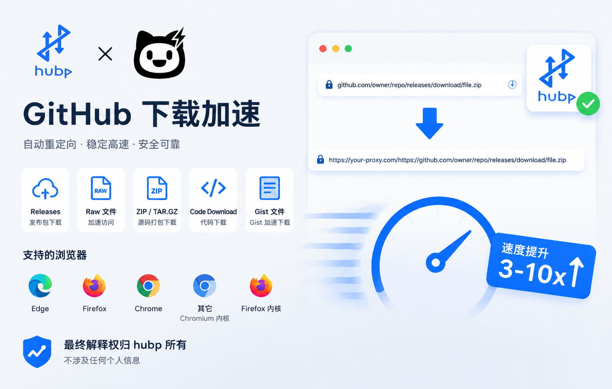

# GitHub Accelerator - GitHub 下载加速器

  
  Made by
  

<!-- 新增的两张图，路径统一改为 .icons/ 目录 -->

  <!-- 第一张：bg.png（位于 .icons/ 下） -->
  
  
  <!-- 第二张：xc.png（位于 .icons/ 下），点击跳转至指定链接 -->
  

智能 GitHub 下载加速器 - 302 重定向模式 · 拦截页面模式 · 支持 IDM 等下载工具

## 📖 项目简介

GitHub Accelerator 是一款智能的浏览器扩展，专为解决中国大陆地区访问 GitHub 下载资源慢的问题而设计。通过自动选择最优代理节点，实现 GitHub 资源下载加速，支持所有下载场景。

## ✨ 主要功能

- 🚀 **智能加速**：自动选择最优代理节点，无需手动配置
- 🌏 **地理位置检测**：智能识别用户所在地区，自动判断是否需要加速
- 🎯 **302 重定向**：采用 302 重定向模式，兼容 IDM 等下载工具[用户须知](#%EF%B8%8F-%E6%B3%A8%E6%84%8F%E4%BA%8B%E9%A1%B9)
- 🛡️ **抗 IDM 绕过**：页面级 `click` / `a.click()` hook，在 IDM 等下载器之前拦截下载点击，确保先进入加速选择流程，原始链接不会被直接抓走
- 🎯 **节点测速**：支持手动节点测速，选择最快节点
- 💾 **缓存机制**：2 小时缓存最优节点，避免重复测速
- 🔧 **灵活配置**：支持全局/域名级别的加速偏好设置
- 📊 **状态监控**：实时显示节点状态、延迟、缓存等信息

## 📦 安装方式

### 扩展商店安装（推荐）

- **Microsoft Edge 扩展商店**: [GitHub Accelerator](https://microsoftedge.microsoft.com/addons/detail/pingkpgackfhaonibagjlibmobkhgdml)
- **Firefox Add-ons 商店**: [GitHub Accelerator](https://addons.mozilla.org/addon/github-accelerator/)
- **Chrome Web Store**: [GitHub Accelerator](https://chromewebstore.google.com/detail/github-accelerator-github/bcbnfbcmbcoogjihnoediilgpfohkdef)

### 手动安装

#### Chrome/Edge 浏览器

1. 从 [Releases](https://github.com/hubporg/ghproxy-extension/releases) 下载 `.crx` 文件
2. 打开浏览器扩展管理页面：
   - Chrome: `chrome://extensions/`
   - Edge: `edge://extensions/`
3. 开启右上角的"开发者模式"
4. 将 `.crx` 文件直接拖拽到扩展管理页面即可安装

#### Firefox 浏览器

1. 从 [Releases](https://github.com/hubporg/ghproxy-extension/releases) 下载 `.xpi` 文件
2. 打开浏览器扩展管理页面：`about:debugging#/runtime/this-firefox`
3. 将 `.xpi` 文件直接拖拽到页面中即可安装

## 🎯 使用指南

### 基本使用

1. 访问 GitHub 下载链接（Releases、Archive、Raw 等）
2. 扩展会自动拦截并显示加速选项
3. 点击"使用加速链接"即可开始下载

### 加速模式

#### 1. 手动选择模式（默认）

- 访问 GitHub 下载链接时显示拦截页面
- 用户可手动选择"使用加速链接"或"直接访问"

#### 2. 始终加速模式

- 在 popup 页面或拦截页面勾选"始终使用加速链接"
- 访问 GitHub 下载链接时自动跳转，不再显示选择页面

#### 3. 域名偏好模式

- 对特定域名设置始终加速或始终直连
- 优先级高于全局设置

### Popup 页面功能

- **节点选择**：查看和选择代理节点（支持API节点和自定义节点）
- **节点测速**：测试所有节点延迟
- **复制地址**：复制当前加速链接
- **自定义节点**：添加、编辑、删除自定义节点
- **地理位置**：显示用户所在地区和网络状态
- **IP重测**：重新检测当前IP地址和地区
- **始终加速开关**：快速启用/禁用自动加速

### 右键菜单功能

在 GitHub 链接上右键点击，可选择：

- 🚀 复制 GitHub 加速链接
- ⚡ 打开 GitHub 加速链接（新标签页）

## 🔍 支持的下载场景

- ✅ GitHub Releases 下载
- ✅ GitHub Archive 下载（ZIP/TAR.GZ）
- ✅ GitHub Raw 文件下载
- ✅ Code Download 下载
- ✅ Gist 文件下载

## 🛠️ 技术原理

1. **地理位置检测**：通过 IP API 判断用户是否在中国大陆
2. **节点测速**：并发测试所有代理节点，选择延迟最低的
3. **URL 转换**：将 GitHub 原始链接转换为代理加速链接
4. **页面级拦截**：MAIN world 内容脚本在 `document_start` 注入，捕获阶段 hook `click` 事件与 `HTMLAnchorElement.prototype.click`，先于 IDM 等下载器拿到下载点击；再配合 `webNavigation` API 兜底导航类下载
5. **缓存机制**：缓存最优节点 2 小时，避免频繁测速

## 🔮 TODO

### 计划中的功能

- [ ] **油猴脚本版本**
  - 开发 Tampermonkey/Greasemonkey 脚本
  - 无需安装扩展，跨浏览器支持
- [ ] 下载统计功能
- [ ] 多语言支持

## ⚠️ 注意事项

1. **公益服务，请勿滥用**：本服务为公益性质，请合理使用
2. **隐私保护**：扩展不会收集任何用户隐私数据
3. **兼容性**：需要 Chrome 111+ / Edge 111+（`world: "MAIN"` 要求）或 Firefox 128+ 及基于其内核的浏览器
4. **网络环境**：建议配合代理工具使用效果更佳
5. **IDM 用户须知**：
   - 扩展会在页面级优先拦截下载点击，先进入加速选择流程，IDM 不会再直接抓到原始链接
   - 在拦截页面点击"使用加速链接"后，IDM 会弹出下载确认框，此时捕获到的是加速后的链接
   - **建议启用"始终使用加速链接"选项**，访问 GitHub 下载链接时会自动跳转，IDM 将直接捕获加速链接，避免重复确认，可能小部分时候会弹2次

## 🤝 贡献指南

欢迎提交 Issue 和 Pull Request！

1. Fork 本仓库
2. 创建特性分支 (`git checkout -b feature/AmazingFeature`)
3. 提交更改 (`git commit -m 'Add some AmazingFeature'`)
4. 推送到分支 (`git push origin feature/AmazingFeature`)
5. 开启 Pull Request

## 📄 许可证

MIT License - 详见 [LICENSE](LICENSE) 文件

## 🙏 致谢

- 感谢所有提供公益代理节点的组织和个人
- Powered By [hubp.org](https://www.hubp.org)

## 📧 联系方式

- 项目地址：https://github.com/hubporg/ghproxy-extension
- 问题反馈：https://github.com/hubporg/ghproxy-extension/issues

---

**注意**：本扩展仅用于学习和研究目的，请勿用于商业用途。
